# Wordpress full installation guide

[TOC]

### XAMPP

Install [XAMPP](https://www.apachefriends.org/download.html) (Download the 8.1.4 version)
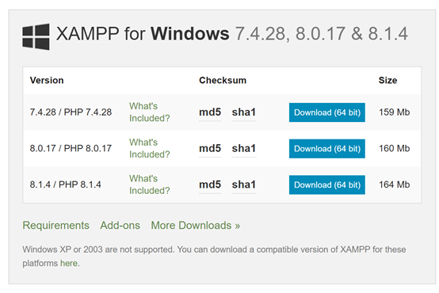

Follow the instructions and you will see "XAMPP Control Panel" after installation
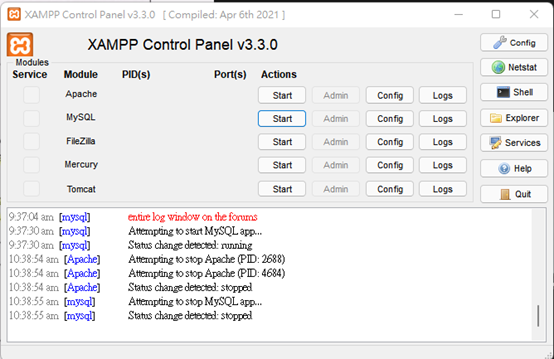

Click the start Button of "Apache" and "MySQL"

And you should see both "Apache" and "MySQL" turns to green.
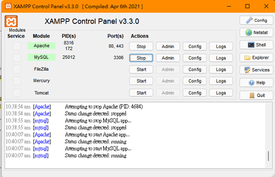

Go to: [localhost/phpmyadmin/](http://localhost/phpmyadmin/)
In your browser and you will see this tab
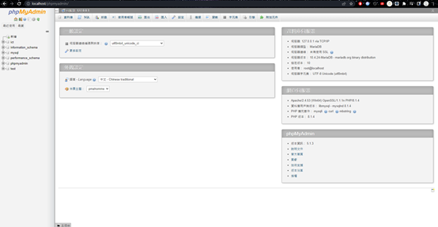

Click "新增"
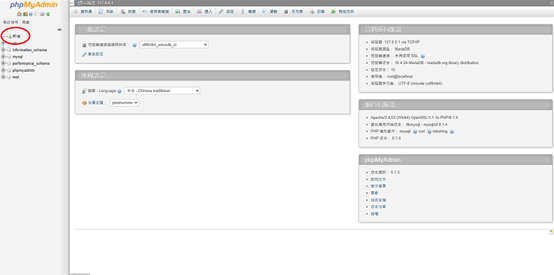

Type your database name and click "建立".
You should remember the database name.
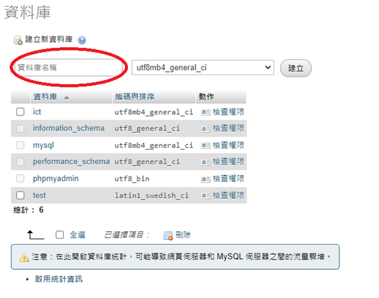

### Set up Wordpress

Next, download [WordPress](https://wordpress.org/download/).
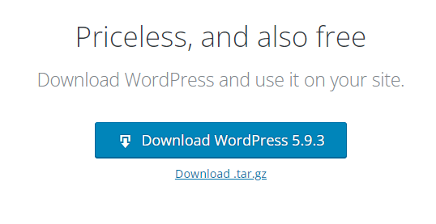

And you will get a WordPress zip file. Unzip and open it
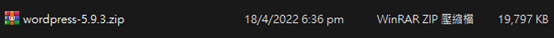

Next, open another file manager and click C drive
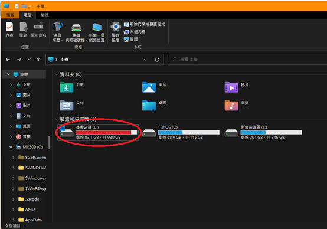

Click xampp
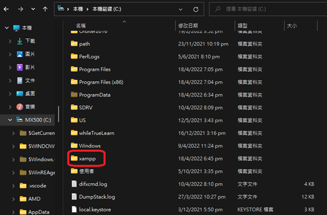

Click htdocs
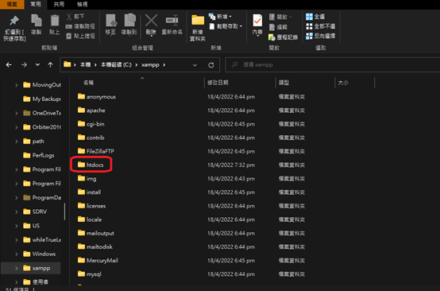

Create a new folder same as your database name created earlier
For me I created `ICT`
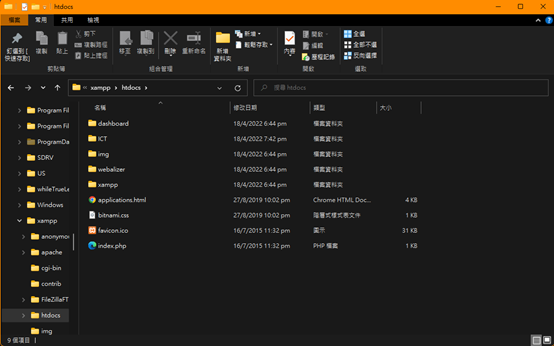

Copy and paste EVERYTHING inside WordPress zip file to the folder
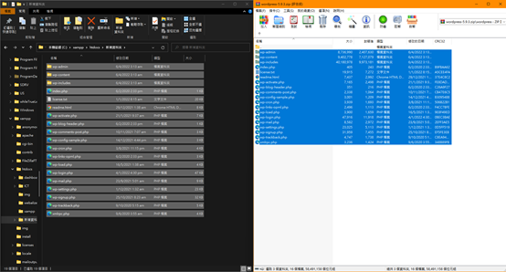

### Start installation

Next, type
localhost/(folder name)/wp-admin
into your browser (replace (foldername) with your folder name).
Choose the language and click "continue"
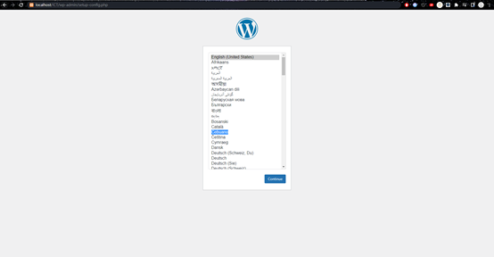

Click "Let’s go"
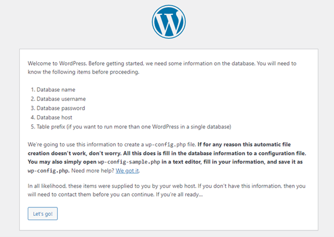

Database Name: Name of your database created before
Username: `root`
Password: `Empty`
Do not change "Database Host" and "Table Prefix"
Click submit
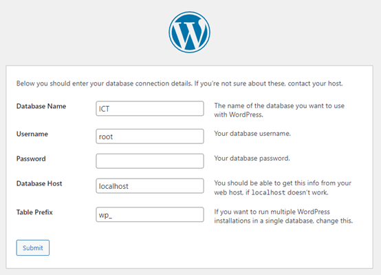

Click "Run the installation"
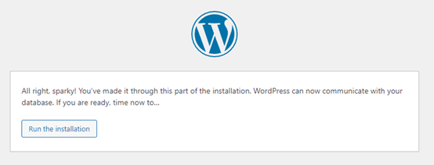

If you received an error, redo everything from [localhost/phpmyadmin](http://localhost/phpmyadmin)

Next, feel free to enter your
Site title, Username, Password and Your Email.
Click "Install WordPress"
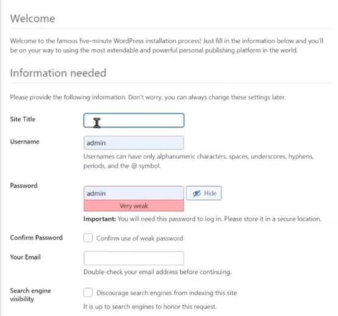

Click Log in
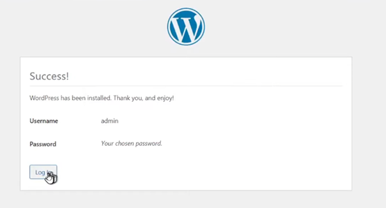

Enter your Username and Password created
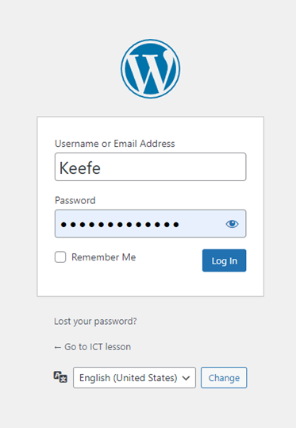

If everything goes right, you will see this page.
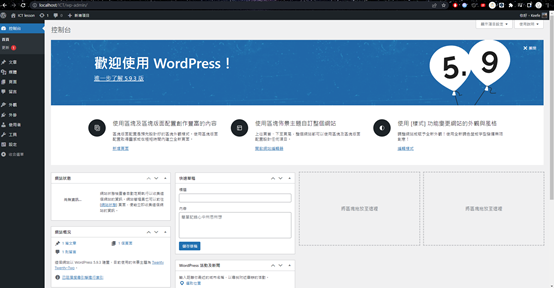

And everything is done
